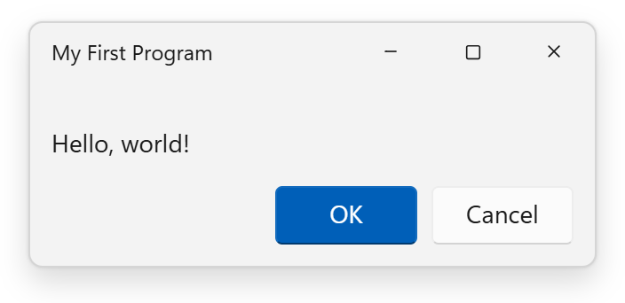
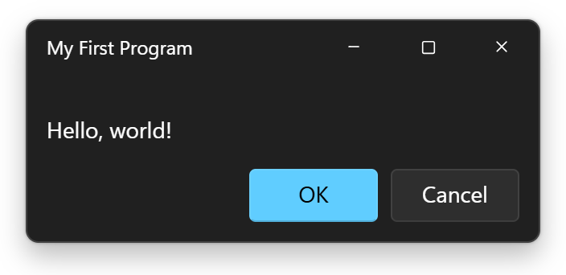
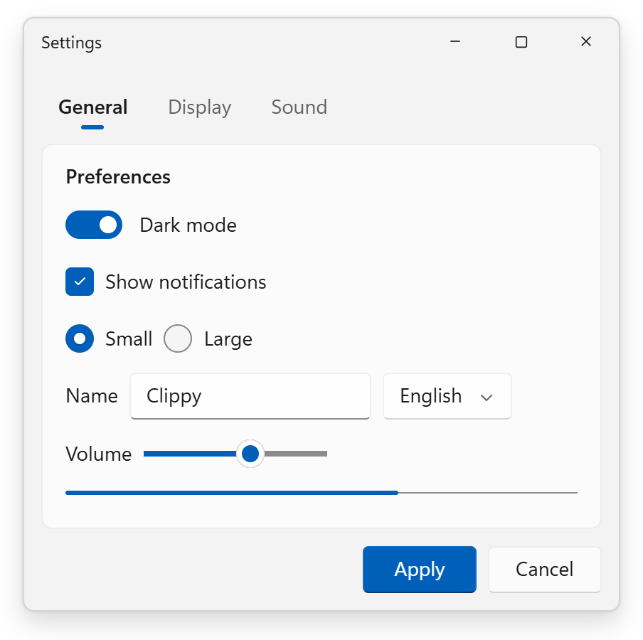

# 11.css

11.css is a CSS library that takes semantic HTML and makes it look like
Windows 11. It's like the next member of the
[98.css](https://github.com/jdan/98.css) → [XP.css](https://github.com/botoxparty/XP.css)
→ [7.css](https://github.com/khang-nd/7.css) family and uses **the same
markup**, so swapping the stylesheet restyles an existing 98/XP/7 page without
changing its HTML.

 

- **CSS only.** No JavaScript, so it works with any framework.
- **Semantic HTML.** Buttons are `<button>`, inputs have `<label>`s, tabs use
  `role="tab"`, and title-bar buttons are named with `aria-label`.
- **Light and dark.** Follows the OS setting, or force it with
  `data-theme="light"` / `data-theme="dark"`.
- **Themeable.** Every colour, radius and shadow is a `--w11-*` custom
  property. Override `--w11-accent` to change the accent colour.

## Usage

From a CDN:

```html
<link rel="stylesheet" href="https://unpkg.com/11.css" />
```

```html
<div class="window" style="width: 320px">
  <div class="title-bar">
    <div class="title-bar-text">My First Program</div>
    <div class="title-bar-controls">
      <button aria-label="Minimize"></button>
      <button aria-label="Maximize"></button>
      <button aria-label="Close"></button>
    </div>
  </div>
  <div class="window-body">
    <p>Hello, world!</p>
    <button class="default">OK</button>
    <button>Cancel</button>
  </div>
</div>
```

### Builds

| File | What it is |
|---|---|
| `dist/11.css` | Everything |
| `dist/11.scoped.css` | Everything, applied only inside a `.win11` container |
| `dist/gui/*.css` | One file per component; import `gui/tokens.css` and `gui/base.css` first |

### Components



Window (title bar, caption buttons, body, status bar, acrylic) · Button ·
CheckBox · ToggleSwitch (`input[type=checkbox][role=switch]`) · OptionButton ·
TextBox and search box · Dropdown and list box · Slider (horizontal and
vertical) · ProgressBar and progress ring · GroupBox · Tabs (Settings selector
and `.tabview`) · ListView (`table`) · TreeView · Tooltip · Scrollbars

See the docs page for every component and its markup, and `compare.html` for
the same HTML rendered with 98.css, XP.css, 7.css and 11.css side by side.

### Dark mode and accent colour

```html
<html data-theme="dark">           <!-- force dark; omit to follow the OS -->
<div data-theme="dark">…</div>      <!-- or darken just one part of the page -->
<div style="--w11-accent: #c239b3">…</div>  <!-- custom accent -->
```

## Development

```sh
npm install
npm start          # build, watch and serve the docs on http://localhost:3011
npm run build      # build dist/ once
npm test           # build checks + screenshot tests (light and dark)
npm run icons      # re-copy the icons listed in icon/manifest.json
npm run screenshots  # regenerate the README images in docs/
```

The screenshot tests use Google Chrome through Playwright. Set
`PW_CHANNEL=msedge` to use Microsoft Edge instead. After an intentional visual
change, refresh the baselines with `npm run test:update` and review the
updated images in `test/visual/__screenshots__/`. Fonts differ between
operating systems, so the baselines are made on Windows (as in CI).

### Project layout

```
gui/        one source file per component (PostCSS with nesting)
icon/       Fluent UI System Icons copied from @fluentui/svg-icons
docs/       the docs page and the family comparison page (EJS)
scripts/    sync-icons.js
test/       build checks and Playwright screenshot tests
build.js    PostCSS pipeline and docs render
server.js   dev server with live reload
```

Components only use `--w11-*` tokens from `gui/_tokens.css`, never raw
colours (`npm test` checks this).

## Credits

- [98.css](https://github.com/jdan/98.css) by Jordan Scales,
  [XP.css](https://github.com/botoxparty/XP.css) by Adam Hammad and
  [7.css](https://github.com/khang-nd/7.css) by Khang Nguyen Duy, whose markup
  and approach 11.css follows (all MIT).
- Icons from [Fluent UI System Icons](https://github.com/microsoft/fluentui-system-icons),
  © Microsoft Corporation, MIT License. See `icon/LICENSE-fluentui-system-icons`.
- Colour and shape values follow the public Fluent 2 / WinUI 3 design
  guidance.

## Disclaimer

11.css is not affiliated with, endorsed by, or sponsored by Microsoft.
Windows is a trademark of Microsoft Corporation. Fonts such as Segoe UI are
used only if they're already installed on the viewer's system; they aren't
distributed with 11.css.

## License

MIT. See [LICENSE](LICENSE).
